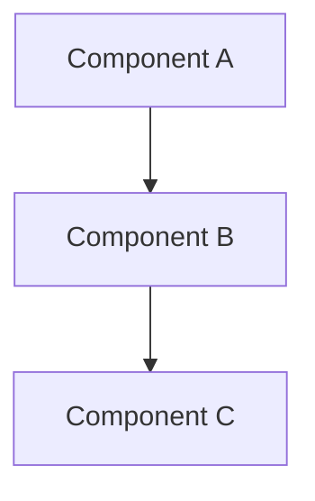

# {{PROJECT_NAME}}

## 🎯 Project Goal
<!-- Mô tả mục tiêu của project -->

## 📋 Requirements

### Functional Requirements
- [ ] Requirement 1
- [ ] Requirement 2
- [ ] Requirement 3

### Technical Requirements
- [ ] Tech requirement 1
- [ ] Tech requirement 2

## 🏗️ Architecture



## 💻 Implementation

### Setup


### Core Features
- [ ] Feature 1
- [ ] Feature 2
- [ ] Feature 3

### Code Structure
```
project/
├── Controllers/
├── Models/
├── Services/
└── ...
```

## 📝 Development Log

### {{DATE}}
<!-- Ghi chép quá trình develop -->

## 🐛 Bugs & Issues
| Issue | Status | Solution |
|-------|--------|----------|
|       |        |          |

## ✅ Completed Features
- [x] Feature X

## 🔍 Code Review Notes
<!-- AI Coach feedback về code -->

## 📚 Learnings
**GET**
<!-- Key learnings từ project này -->
**END**

## 🚀 Deployment
<!-- Deployment notes nếu có -->

## 🔗 Links
- GitHub: 
- Demo: 
- Docs: 

---
*Project started: {{START_DATE}}*  
*Last updated: {{DATE}}*
