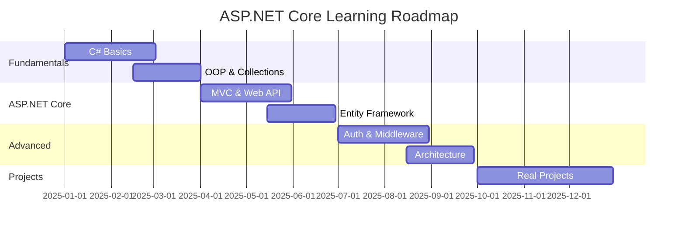

# ASP.NET Core Backend Developer - Lộ trình 12 tháng

## 🎯 Mục tiêu chung
Sau 12 tháng, bạn sẽ:
- ✅ Thành thạo C# và .NET ecosystem
- ✅ Xây dựng RESTful APIs với ASP.NET Core
- ✅ Làm việc với databases (EF Core, SQL)
- ✅ Hiểu Clean Architecture và Design Patterns
- ✅ Deploy ứng dụng production-ready
- ✅ Có portfolio với 3-4 real-world projects

---

## 📅 Timeline Overview



---

## Tháng 1-3: C# Fundamentals (Foundation Phase)

### Tháng 1: C# Basics
**Mục tiêu:** Nắm vững syntax và cơ bản của C#

#### Tuần 1-2: Syntax & Data Types
- [x] Variables, constants, data types
- [ ] Operators và expressions
- [ ] Console I/O
- [ ] Type conversion và casting
- [ ] String manipulation
- [ ] **Project:** Console Calculator

#### Tuần 3-4: Control Flow & Methods
- [ ] If-else, switch statements
- [ ] Loops (for, while, foreach)
- [ ] Methods & parameters
- [ ] Return values & overloading
- [ ] Exception handling basics
- [ ] **Project:** Number Guessing Game

### Tháng 2: Object-Oriented Programming
**Mục tiêu:** Hiểu và áp dụng OOP principles

#### Tuần 1-2: Classes & Objects
- [ ] Class definition và instantiation
- [ ] Fields, properties, methods
- [ ] Constructors và destructors
- [ ] Access modifiers
- [ ] Static members
- [ ] **Project:** Bank Account System

#### Tuần 3-4: Inheritance & Polymorphism
- [ ] Inheritance cơ bản
- [ ] Method overriding
- [ ] Abstract classes
- [ ] Interfaces
- [ ] Polymorphism
- [ ] **Project:** Shape Calculator

### Tháng 3: Collections & LINQ
**Mục tiêu:** Làm chủ data structures và querying

#### Tuần 1-2: Collections
- [ ] Arrays và Lists
- [ ] Dictionary và HashSet
- [ ] Queue và Stack
- [ ] Generic collections
- [ ] Collection methods
- [ ] **Project:** Todo List Manager

#### Tuần 3-4: LINQ & Lambda
- [ ] Lambda expressions
- [ ] LINQ query syntax
- [ ] LINQ methods (Select, Where, OrderBy)
- [ ] Joins và grouping
- [ ] Async enumerable
- [ ] **Project:** Student Grade Analyzer

---

## Tháng 4-6: ASP.NET Core Basics (Web Development Phase)

### Tháng 4: ASP.NET Core MVC
**Mục tiêu:** Xây dựng web applications với MVC pattern

#### Tuần 1-2: MVC Fundamentals
- [ ] MVC pattern overview
- [ ] Project structure
- [ ] Controllers và Actions
- [ ] Views và Razor syntax
- [ ] Models và ViewModels
- [ ] Routing basics
- [ ] **Project:** Blog Engine (MVC)

#### Tuần 3-4: Forms & Validation
- [ ] Model binding
- [ ] Form handling
- [ ] Validation attributes
- [ ] Tag Helpers
- [ ] Client-side validation
- [ ] **Project:** Contact Form System

### Tháng 5: Web API & Entity Framework
**Mục tiêu:** Build RESTful APIs với database integration

#### Tuần 1-2: Web API Basics
- [ ] REST principles
- [ ] API Controllers
- [ ] HTTP verbs (GET, POST, PUT, DELETE)
- [ ] Status codes
- [ ] JSON serialization
- [ ] Swagger/OpenAPI
- [ ] **Project:** Todo API

#### Tuần 3-4: Entity Framework Core
- [ ] Code-First approach
- [ ] DbContext và DbSet
- [ ] Migrations
- [ ] CRUD operations
- [ ] Relationships (1-1, 1-N, N-N)
- [ ] **Project:** Product Catalog API

### Tháng 6: Advanced API Features
**Mục tiêu:** Professional API development

#### Tuần 1-2: API Best Practices
- [ ] DTOs và AutoMapper
- [ ] Pagination
- [ ] Filtering & searching
- [ ] Sorting
- [ ] Error handling globally
- [ ] **Project:** E-Commerce API v1

#### Tuần 3-4: Dependency Injection
- [ ] DI fundamentals
- [ ] Service lifetimes (Transient, Scoped, Singleton)
- [ ] Repository Pattern
- [ ] Unit of Work
- [ ] **Project:** Refactor with DI

---

## Tháng 7-9: Advanced Topics (Professional Phase)

### Tháng 7: Authentication & Authorization
**Mục tiêu:** Secure your applications

#### Tuần 1-2: Authentication
- [ ] ASP.NET Core Identity
- [ ] User registration & login
- [ ] Password hashing
- [ ] JWT tokens
- [ ] Token-based auth
- [ ] **Project:** User Management API

#### Tuần 3-4: Authorization
- [ ] Role-based authorization
- [ ] Claims-based authorization
- [ ] Policy-based authorization
- [ ] Securing API endpoints
- [ ] Refresh tokens
- [ ] **Project:** Admin Dashboard API

### Tháng 8: Middleware & Configuration
**Mục tiêu:** Understand ASP.NET Core pipeline

#### Tuần 1-2: Middleware
- [ ] Middleware pipeline
- [ ] Custom middleware
- [ ] Exception handling middleware
- [ ] Logging middleware
- [ ] Request/Response manipulation
- [ ] **Project:** Logging System

#### Tuần 3-4: Configuration & Environments
- [ ] appsettings.json
- [ ] Environment variables
- [ ] User secrets
- [ ] Options pattern
- [ ] Development vs Production
- [ ] **Project:** Multi-environment API

### Tháng 9: Clean Architecture
**Mục tiêu:** Build maintainable applications

#### Tuần 1-2: Architecture Patterns
- [ ] Layered Architecture
- [ ] Clean Architecture principles
- [ ] SOLID principles
- [ ] Dependency inversion
- [ ] Domain-Driven Design basics
- [ ] **Project:** Restructure existing project

#### Tuần 3-4: Design Patterns
- [ ] Repository Pattern (deep dive)
- [ ] Factory Pattern
- [ ] Strategy Pattern
- [ ] CQRS basics
- [ ] MediatR library
- [ ] **Project:** CQRS Todo API

---

## Tháng 10-12: Real-World Projects (Portfolio Phase)

### Tháng 10: Project 1 - Blog Platform API
**Mục tiêu:** Full-featured blogging platform

#### Features:
- [ ] User authentication (JWT)
- [ ] CRUD for posts, comments
- [ ] Categories & tags
- [ ] Image upload (file storage)
- [ ] Pagination & search
- [ ] Rich text editor support
- [ ] Admin panel
- [ ] **Tech:** ASP.NET Core 8, EF Core, SQL Server, Swagger

### Tháng 11: Project 2 - E-Commerce Backend
**Mục tiêu:** Production-ready e-commerce API

#### Features:
- [ ] Product catalog với categories
- [ ] Shopping cart system
- [ ] Order processing
- [ ] Payment integration (mock)
- [ ] Inventory management
- [ ] User reviews & ratings
- [ ] Email notifications
- [ ] **Tech:** Clean Architecture, Repository Pattern, AutoMapper

### Tháng 12: Project 3 - Enterprise Application
**Mục tiêu:** Showcase advanced skills

#### Features:
- [ ] Multi-tenant system
- [ ] Advanced authorization (policies)
- [ ] Caching (Redis mock or in-memory)
- [ ] Background jobs (Hangfire)
- [ ] API versioning
- [ ] Unit & integration tests
- [ ] Docker containerization
- [ ] CI/CD pipeline (GitHub Actions)
- [ ] **Tech:** All skills combined

---

## 📊 Progress Tracking

### Overall Progress
- **Phase 1 (Month 1-3):** 
- **Phase 2 (Month 4-6):** 
- **Phase 3 (Month 7-9):** 
- **Phase 4 (Month 10-12):** 

### Current Status
- 📅 **Current Month:** Tháng 1
- 📚 **Current Topic:** C# Basics - Syntax & Data Types
- ✅ **Completed Topics:** 0/100+
- 🎯 **Next Milestone:** Complete first Console Calculator

---

## 📚 Learning Resources

### Official Documentation
- [Microsoft Learn - C#](https://learn.microsoft.com/en-us/dotnet/csharp/)
- [ASP.NET Core Documentation](https://learn.microsoft.com/en-us/aspnet/core/)
- [Entity Framework Core](https://learn.microsoft.com/en-us/ef/core/)

### Recommended Courses
- C# Fundamentals (Pluralsight)
- ASP.NET Core Path (Udemy)
- Clean Architecture (YouTube - Jason Taylor)

### Practice Platforms
- LeetCode (C# problems)
- HackerRank
- Codewars

---

## 🎯 Success Criteria

Sau 12 tháng, bạn PHẢI đạt được:
1. ✅ Build được RESTful API hoàn chỉnh từ zero
2. ✅ Hiểu và áp dụng Clean Architecture
3. ✅ Tự tin với EF Core và database operations
4. ✅ Implement authentication & authorization
5. ✅ Portfolio với 3 production-quality projects
6. ✅ Đọc hiểu và contribute vào codebases khác

---

## 💡 Tips học tập

### Học hiệu quả
- 🎯 **Consistency > Intensity:** 2 giờ mỗi ngày tốt hơn 14 giờ cuối tuần
- 📝 **Document everything:** Ghi chép với AI Coach (GET...END blocks)
- 💻 **Code everyday:** Practice makes perfect
- 🤝 **Join communities:** Discord, Reddit (r/dotnet), Stack Overflow

### Khi gặp khó khăn
- ❓ **Ask AI Coach:** "Đánh giá code này", "Giải thích X"
- 📖 **Read docs:** Microsoft docs rất chất lượng
- 🔍 **Debug systematically:** Breakpoints, logging
- 🔄 **Refactor:** Code tốt đến từ nhiều lần refactor

---

**🚀 Bắt đầu ngay hôm nay!**

Chat với AI Coach:
```bash
python ai_coach.py
> Học tiếp thôi
```
